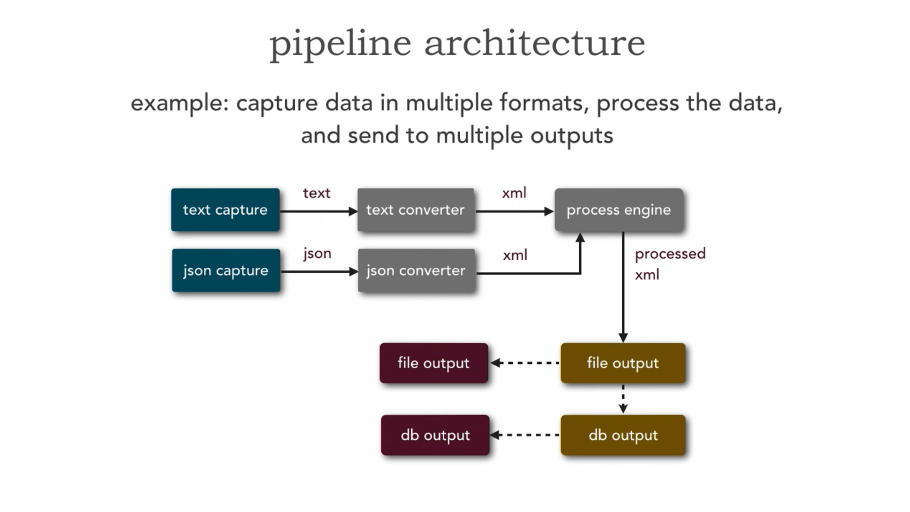

# Architectural Patterns

|                               | agility | deployment | testability | performance | scalability | simplicity | cost  |
| ----------------------------- | ------- | ---------- | ----------- | ----------- | ----------- | ---------- | ----- |
| Layered Architecture          | -       | -          | +           | -           | -           | +          | $     |
| Microkernel Architecture      | +       | +          | +           | -           | -           | +          | $$    |
| Event-Driven Architecture     | +       | +          | -           | +           | +           | -          | $$$   |
| Pipeline Architecture         | +       | -          | +           | -           | -           | +          | $     |
| Space-Based Architecture      | +       | +          | -           | +           | +           | -          | $$$$  |
| Microservices Architecture    | +       | +          | +           | -           | +           | -          | $$$   |
| Service-Oriented Architecture | -       | -          | -           | -           | +           | -          | $$$$  |
| Service-Based Architecture    | +       | +          | +           | -           | +           | -          | $$    |

## Layered Architecture

- Good for testing, simplicity, costs
- Not good for agility, deployment, performance, scalability
- Separation of Concerns
- Layers of isolation
- Monolithic
  - Presentation Layer (Closed)
  - Business Layer (Closed)
    - Business Rules Engine vs Custom Written Business Layers
  - Persistence Layer (Closed)
  - Database Layer (Closed)
    - Easy to change database
  - External Services Layer (Closed)
    - Easy to change external services

## Microkernel Architecture

- Good for testing, simplicity, costs, deployment
- Not good for performance, scalability
- Monolithic
- plug-in architecture
- core system
  - minimal functionality to run system general business rules and logic no custom processing - general, happy path
  - has a registry of plug-in modules -> name, location, version
  - plug-in contracts
    - defines the interface between the core system and the plug-in modules
    - may need an adapter if the plug-in modules are not compatible
- plug-in modules
  - standalone independent modules specific additional rules or logic
- Eclipse, Web Browser, claims processing

## Event-Driven Architecture

- Distributed
- Good for agility, deployment, performance, scalability
- Not good for testing, simplicity, costs
- Asynchronous is difficult to test
- Correlation ID's
- Tag

### broker topology

- event channel
  - message queues
- event
  - initiate process
- event processors
  - send messages to event channels
  - subscribe to event channels
- challenges
  - error handling
    - error queues
    - verification messages
  - unified notification message to customer
    - email, sms, voice, mobile push, in-app
    - in async systems coordination happens at the end
- easier to evolve

### mediator topology

- event
- event queue
- event mediator
  - process engine
    - coordination
    - routing
    - transformation
    - error handling
    - ....
  - implementation
    - Spring Coordination
    - Mule
    - ESB
    - Camel
    - Business Process Execution Language (BPEL)
  - Business Process Management(BPM) Tools
- event channels
- event processors
  - messages all goes through the mediator
- less easy to evolve

### Eventual Consistency

Building reliable distributed systems at a worldwide scale demands trade-offs between consistency and availability.

### Conway's Law

Organizations design systems that mirror their own communication structures; communications, partitions, ...;

>  "organizations which design systems ... are constrained to produce designs which are copies of the communication structures of these organizations." Melvin Conway, 1968

People around the mediators constraints the system based on Conway's Law. The mediator becomes a monolith by its own.

### CQRS

- Command Query Responsibility Segregation
- Background Replication Update Thread from Command to Query
- We lost Transactional Support
- It's a Eventual Consistency
- System of Records with CQRS that updates a reporting database as well
- Keep track vs reporting
- eventual consistency, events & reports
- Command
  - write
- Query
  - read

## Pipeline Architecture

- Monolithic
- pipes and filter architecture
- pipe
  - pipe -> transform -> pipe
  - uni-directional only
  - usually point-to-point (single deployment)
  - payload can be any type (text, bytes, objects, etc.)
- filter
  - self-containted and independent from other filters
  - usually designed to perform a single specific task
  - for types of filters(producer, consumer, transformer, and tester)
    - producer
      - starting pointing, outbound only
    - transformers
      - input, processing, output
    - tester
      - input, discard, or pass-thru
      - conditional processing
    - consumer
      - endpoint, inbound only
  - examples:
    - map reduce
    - functional programming
    - data flow

## Space-Based Architecture

- processing unit
  - contains your app
    - modules
  - in memory data grid
  - data replication engine
  - deployment unit
- virtualized middleware
  - messaging grid
    - input, request, message state, session state
    - web server, tomcat, nginx, proxies, session manager
  - data grid
    - data replication between processing units
    - distributed cache
  - processing grid
    - orchestrators
    - integration hub
      - apache camel, spring integration, mule
  - deployment manager

## Monolithic Architecture

## Broker-Based Architecture

## Peer-to-Peer Architecture
## Service-Oriented Architecture
## Hexagonal Architecture
## Clean Architecture
## CQRS Architecture

